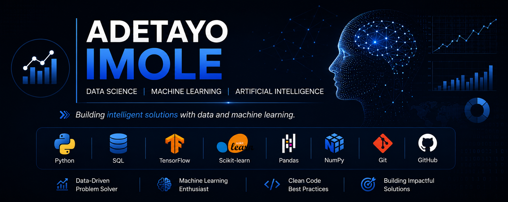

  

# Hi there! I'm Adetayo Imole

Welcome to my GitHub!

I'm an undergraduate Data Science student with a passion for solving real-world problems using data, machine learning, and artificial intelligence. I enjoy turning raw data into meaningful insights and building intelligent solutions through practical projects.

---

## About Me

- Undergraduate Data Science Student
- Passionate about Artificial Intelligence and Machine Learning
- Interested in Deep Learning and Computer Vision
- Continuously improving my Python, SQL, and data analysis skills
- Building projects that solve real-world business problems

---

## Technical Skills

### Programming Languages
- Python
- SQL

### Data Analysis & Visualization
- Pandas
- NumPy
- Matplotlib

### Machine Learning & AI
- Scikit-learn
- TensorFlow
- Keras

### Tools & Technologies
- Git
- GitHub
- Jupyter Notebook
- Google Colab
- SQL Server Management Studio (SSMS)

---

## Featured Projects

### CNN Image Classification
A deep learning project using Convolutional Neural Networks (CNNs) to classify images with TensorFlow and Keras.

### Telecommunication Customer Churn Prediction *(In Progress)*
An end-to-end machine learning project for predicting customer churn using data preprocessing, exploratory data analysis, feature engineering, and classification models.

---

## What I'm Learning

- Machine Learning
- Deep Learning
- Computer Vision
- Artificial Intelligence
- Data Analytics
- Model Deployment

---

## Goals

- Build a portfolio of professional Data Science projects
- Contribute to open-source projects
- Develop practical AI solutions
- Secure a Data Science internship
- Keep learning and improving every day

---

## Thanks for Visiting

Thank you for taking the time to visit my profile. Feel free to explore my repositories and follow my journey as I continue building projects in Data Science, Machine Learning, and Artificial Intelligence.
